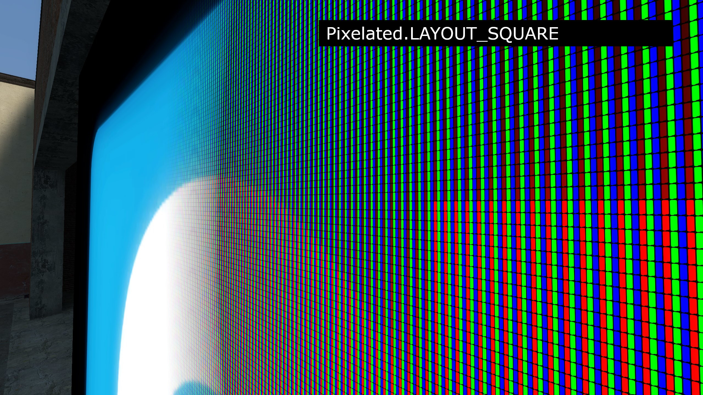
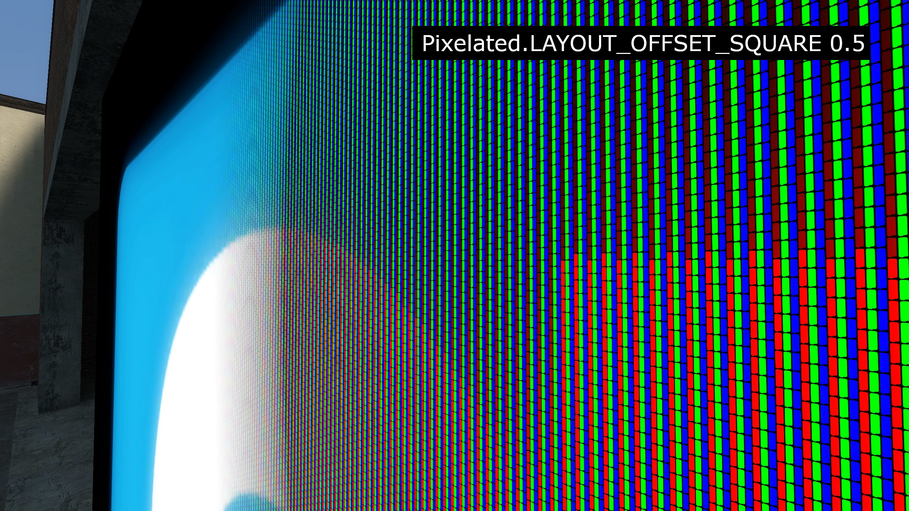
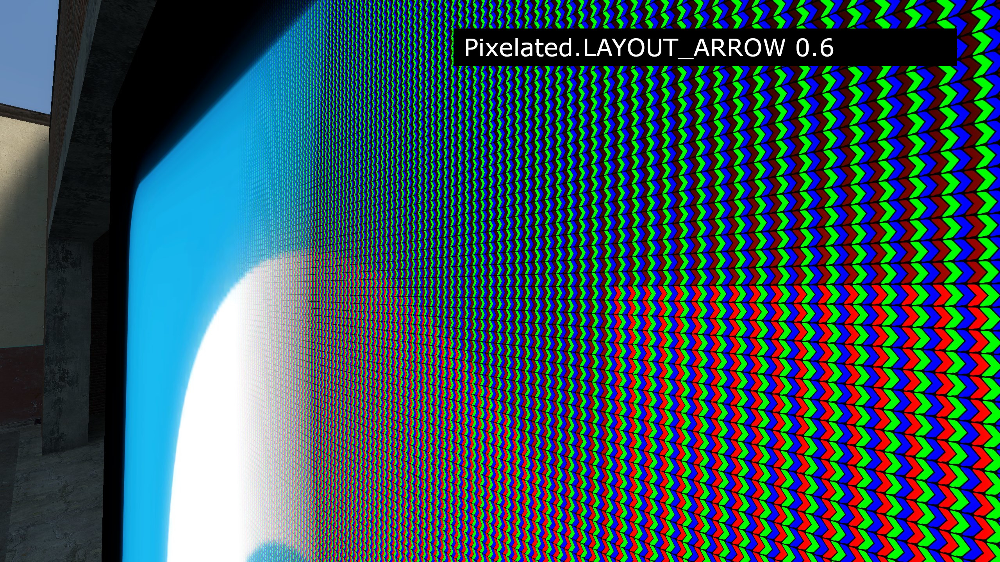

# Pixelated LCD Shader  

## Usage

### Examples

See `lua/pixelated_examples` folder.

### Enums

---

#### Pixelated.LAYOUT

| Enum | Value |
| ---- | ----- |
| `Pixelated.LAYOUT_SQUARE` | 1 |
| `Pixelated.LAYOUT_OFFSET_SQUARE` | 2 |
| `Pixelated.LAYOUT_ARROW` | 3 |
| `Pixelated.LAYOUT_TRIANGULAR` | 4 |

> [!CAUTION]
> Unfortunately, LAYOUT_TRIANGULAR is currently broken.







### Functions

---

#### Pixelated.SetSettings

```lua
-- cull : boolean
-- depthTest : boolean
-- writeDepth : boolean
-- linearBaseTexture : boolean
-- linearPixelMask : boolean
function Pixelated.SetSettings(cull, depthTest, writeDepth, linearBaseTexture, linearPixelMask)
```

This function sets a few internal vars. Usually you dont need calling that.

---

#### Pixelated.SetPixelLuma

```lua
-- luma : number
function Pixelated.SetPixelLuma(luma)
```

Sets sub-pixel brightness. Recommended values from 1 to 4.

---

#### Pixelated.SetPixelLayout

```lua
-- typ : Pixelated.LAYOUT_*
-- offset : number
function Pixelated.SetPixelLayout(typ, offset)
```

Sets sub-pixel layout. [Check up the enums](#enums)

---

#### Pixelated.SetPixelMask

```lua
-- texture: ITexture | string
-- width : number = texture:Width() or 64 if texture is string
-- height : number = texture:Height() or 64 if texture is string
function Pixelated.SetPixelMask(texture, width, height)
```

Sets sub-pixel mask. Built-in textures:
* pixelated/pixelstripes1.vtf ***Presented in screenshots, default***
* pixelated/pixelstripes2.vtf
* pixelated/pixelstripes3.vtf

---

#### Pixelated.SetDefaultPixelMask

```lua
function Pixelated.SetDefaultPixelMask()
```

Restores original sub-pixel mask and their width with height.

---

#### Pixelated.SetBaseTexture

```lua
-- texture: ITexture | string
-- width : number = texture:Width() or 512 if texture is string
-- height : number = texture:Height() or 512 if texture is string
function Pixelated.SetBaseTexture(texture, width, height)
```

Sets the base texture.

---

#### Pixelated.StartDraw

```lua
function Pixelated.StartDraw()
```

Start the drawing shader, setup rendering context.

---

#### Pixelated.EndDraw

```lua
function Pixelated.EndDraw()
```

End the drawing. restores rendering context

---

#### Pixelated.DrawWithFunc

```lua
-- func: function
-- useDepthPass: boolean? or function?
function Pixelated.DrawWithFunc(func, useDepthPass)
```

Combines StartDraw and EndDraw, and also writes (if true or a function is passed to `useDepthPass`) to the [depth buffer](https://wiki.facepunch.com/gmod/render.GetResolvedFullFrameDepth).
